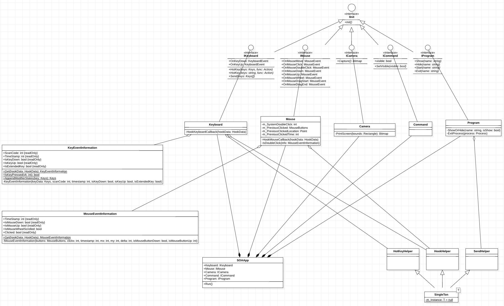

# SOA : Spear of Adun
아둔의 창(Spear of Adun)

모든 것을 뚫는 최고의 창



## 개발로 얻는 이점:
내가 재밌다.

## 개발 기록:
#### 01. [005] 프로젝트 생성, 화면 전체 스크린샷
- C# 프로젝트 생성
- KKK 네임스페이스 (KakaoKungKuotta)
- 스크린샷을 위한 ScreenCapture 클래스

#### 02. [007] 캡처영역 생성

- 폼작업(투명, 빨간색 테두리, 드래그 이동, 항상 위)

#### 03. [008] 캡처영역 + 스크린샷

- 캡처영역 내에서 자동 스크린샷(현재 1초)
- 스크린샷 이미지 포맷 jpeg에서 png로 수정

#### 04. [009] 현재 실행중인 프로그램 목록 출력

- window 관련 함수 WindowImport 클래스로 이동
- 현재 실행중인 프로그램 목록 콘솔에 출력

#### 05. [011] winapi 함수 Win32 클래스로 이동 및 정리

- enum, flag 추가, summary 정리

#### 06. [012] 원하는 프로그램 핸들 가져오기

- Win32.FindWindow[013]

#### 07. [013] 가져온 핸들로부터 프로그램 위치, 크기, 상태 정보

- Win32.GetWindowPlacement
- 위치, 크기 정보에 기반하여 프로그램 위치에 빨간색 테두리 생성

#### 08. [014], [015] 키보드 핫키 완료, 후킹 도전중

- HotKeyHelper 클래스
- 후킹은 좀 더 공부후에 시도.

#### 09. [016], [017] 외부 스크립트 실행

- using Microsoft.CodeAnalysis.Scripting;
- using Microsoft.CodeAnalysis.CSharp.Scripting;

#### 10. [018], [019] 키보드, 간편한 핫키

```c#
Keyboard.HotKey(Keys.A,                () => { Console.WriteLine("a"); });
Keyboard.HotKey(Keys.A | Keys.Control, () => { Console.WriteLine("a + ctrl"); });
Keyboard.HotKey(Keys.A | Keys.Alt,     () => { Console.WriteLine("a + alt"); });
```

- PInvoke.* 라이브러리 적용

#### 11. [020] Camera, Command

```c#
// 캡처, 저장
Keyboard.HotKey(Keys.A | Keys.Control, () => { Console.WriteLine("ctrl + a");
    Camera.Capture().Save();
    // save() -> 현재 날짜 파일명으로 저장
});

// 콘솔창 토글
Keyboard.HotKey(Keys.A | Keys.Alt,     () => { Console.WriteLine("alt + a");
    Command.visible = !Command.visible;
});
```

- 캡쳐 기능
- 콘솔창 on/off

#### 12. [021], [022] 훅 헬퍼, 싱글톤, 키보드 후킹

- HookHelper.cs
- 조금 더 수정해야 한다. 마우스 후킹 개발할 때 수정 예정

```c#
Console.WriteLine("Hello KKK World!");

// 1. 단축키(HotKey) : (단축키를 사용할 경우 프로세스의 키입력을 무시한다.)
Keyboard.HotKey(Keys.A,  () => { Console.WriteLine("a"); });

Keyboard.HotKey(Keys.A | Keys.Control, () => { Console.WriteLine("ctrl + a");
    // 현재 화면 캡쳐 및 자동 저장 (파일명: 현재 날짜)
    Camera.Capture().Save();
});

Keyboard.HotKey(Keys.A | Keys.Alt, () => { Console.WriteLine("alt + a");
    // 콘솔창 토글
    Command.visible = !Command.visible;
});

// 2. 키보드 전역 훅 : (다른 프로세스에서 키보드 입력을 해도 실행된다.)
// 2.1 키를 누를 때
Keyboard.OnKeyDown += (key) => {
    switch (key)
    {
        case Keys.B: Console.WriteLine("B가 눌렸다."); break;
        case Keys.C: Console.WriteLine("C가 눌렸다."); break;
    }
};

// 2.2 키를 땔 때
Keyboard.OnKeyUp += (key) => {
    switch (key)
    {
        case Keys.E: Console.WriteLine("E가 때졌다."); break;
        case Keys.F: Console.WriteLine("F가 때졌다."); break;
    }
};

// 3. 테스트 함수
Test();
private void Test()
{
    Console.WriteLine("This is Test function..");
}
```

#### 13. [023] 마우스 후킹

- IMouse, Mouse

```c#
// 4. 마우스 전역 훅 : (다른 프로세스에서 마우스 입력을 해도 실행된다.)
Mouse.OnMouseDown += (x, y) =>
{
    Console.WriteLine(string.Format("click (x: {0}, y: {1})", x, y));
}
```

#### 14. [028] 프로그램 종료

- IProgram, Program, SendHelper

```c#
// Zulip이라는 프로그램 종료.
Program.Close("Zulip");
```